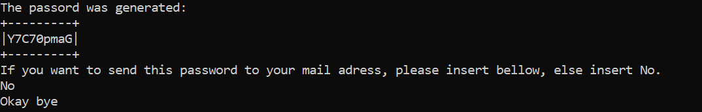
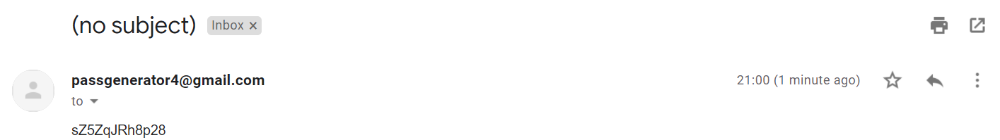

# Password generator with sending via email 
## Description
In this file, you will find a random key creation following the normal conditions for creating passwords, such as containing 2 uppercase letters, 2 lowercase letters, between 8 and 16 characters etc. At the end of the password creation, you are asked to insert an email if you wish, if you insert an email is immediately sent to the recipient.\
PS: Flaws were detected in the Linux operating system because of the python smtplib package, so this project was run on windows.

## Run me 

To run this program open the command line and complete the steps bellow:

1) git clone https://github.com/NunoSampaioCarvalho/nun-fix-cod.git
2) python3 key_password_generator.py

## Expected Outputs

